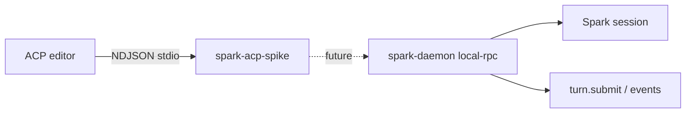

# ACP spike (Agent Client Protocol)

Status: **experimental / not default-enabled**. Official SDK: [`@agentclientprotocol/sdk`](https://www.npmjs.com/package/@agentclientprotocol/sdk) `1.2.1`.

Package: [`packages/spark-acp-spike`](../../packages/spark-acp-spike/).

## Goal

Prove that an ACP-compatible editor (Zed, JetBrains ACP clients, `acpx`, …) can drive a Spark-shaped agent endpoint over NDJSON stdio **without** changing spark-daemon's default startup path.

## What the stub does today

| ACP method | Spike behavior |
| --- | --- |
| `initialize` | Returns `PROTOCOL_VERSION` + stub `agentInfo` |
| `session/new` | Allocates an ACP session id and a placeholder `sparkSessionId` |
| `session/prompt` | Emits one `agent_message_chunk` acknowledging the prompt |
| `session/cancel` | No-op (no daemon invocation yet) |

In-process smoke: `pnpm --filter @zendev-lab/spark-acp-spike test`.

Optional stdio agent (manual): `pnpm --filter @zendev-lab/spark-acp-spike run stdio`.

## How daemon would expose ACP (future wiring)

Do **not** fold this into the default `spark daemon` listen path until productized. Suggested opt-in shape:

1. **Transport**: spawn or attach an NDJSON stdio ACP agent process (editor launches agent), or later an experimental HTTP/WebSocket ACP server using `@agentclientprotocol/sdk/experimental/*`.
2. **Session map**:
   - ACP `session/new` → daemon `session.create` / open existing Spark session for `cwd`.
   - Store `acpSessionId ↔ sparkSessionId` in a small adapter table (memory first).
3. **Prompt → turn**:
   - ACP `session/prompt` → daemon local-rpc `turn.submit` (or oRPC equivalent) with the concatenated text blocks.
   - ACP `session/cancel` → cancel the active invocation.
4. **Events → updates**:
   - Stream invocation events / agent message chunks as ACP `session/update` (`agent_message_chunk`, `tool_call`, …).
   - Map Spark ask/approval waits to ACP `session/request_permission` when permissions are required.
5. **Auth / capability**: advertise limited `agentCapabilities` until load/resume/fork are implemented against Spark session store.

## Non-goals for this spike

- No changes to `apps/spark-daemon` startup, CLI flags, or session/repro WIP.
- No production permission model, MCP-server list forwarding, or document sync.
- No publish of `@zendev-lab/spark-acp-spike` (package is `private`).
