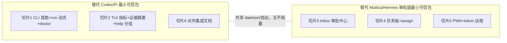

# Spark 产品改进计划

## 背景与定位

上一轮"架构重构与债务清理"计划的技术部分已基本落地：`spark-protocol` 统一词汇表 + daemon `command-dispatcher`、`packages/spark-server` 抽出、`spark-memory`/`spark-web` 自研扩展、prompt cache 观测、docs 分层均已完成。当前问题不再是技术债，而是**架构已经干净，产品还没有立起来**。

Spark 横跨两个赛道：

| 赛道 | 代表 | 用户买单的点 |
|---|---|---|
| Coding agent 本体 | Codex、Pi | 上手 5 分钟内出活、终端体验好、可脚本化、可扩展 |
| Agent 管理/远程面 | Multica、Hermes Workspace | 像管理队友一样派活、手机上看进度和审批、团队知识沉淀 |

Spark 的独特资产是两者的中间层：daemon 执行平面 + 证据制品 + 任务 DAG + 可验证 goal + 工作流脚本。产品叙事：**"一个自带审计证据的工程 agent，终端里是 Codex，浏览器里是 Multica。"**

## 两条最小可信包



## 切片 1 — CLI：首跑体验 + 脚本化动词（小，独立可发）

现状：`apps/spark-cli/src/cli.ts` 是 195 行 dispatcher；headless 走 `spark --print` / `--mode json|rpc`（Pi parity 遗产）；daemon CLI 有 install/doctor/status/login/submit/workspace，但分散。

1. **首跑引导**：`spark` 检测无凭证 → 一屏 TUI 引导流（选 provider → 粘 key 或 OAuth → 选默认模型 → 可选启动 daemon）。复用已有 `auth.ts` OAuth 与 model registry。
2. **`spark run` 动词**（dispatcher 加映射，成本极低）：

```text
spark run "修掉这个测试"           # 前台一次性执行，人类可读输出
spark run --json "..."             # JSONL 事件流，CI/管道友好
spark run --resume <session> "..."
spark bg "..."                     # 提交到 daemon 队列即回（现 spark daemon submit）
```

旧 `--print`/`-p` 保留为别名。
3. **`spark doctor` 顶层化**：一次体检 daemon/凭证/workspace/cockpit。

## 切片 2 — TUI：差异化可见性（小）

现状：parity 矩阵基本打满；风险是概念超载（六个意图动词 + 七种状态概念）和差异化能力不可见。

1. **footer 指标格**：`cache 87% · $0.42 · ctx 41%`——数据已有（cache 观测已落地），只差呈现；对标 pi-cache-optimizer 的 footer 统计。
2. **完成证据摘要行**：`✔ task done · 3 artifacts · review passed` + cockpit 深链，让证据链从内部机制变成每天可见的价值。
3. **`/help` 分组**：默认层只教普通输入、`/plan`、`/implement`、`/model`、`/resume`；`/goal /loop /workflow /ultracode` 归进阶层。不删能力，只管理暴露顺序。首跑空态屏用 3 行文案。

## 切片 3 — Cockpit Inbox 审批中心（中，产品价值最高）

现状 inbox 是只读投影项列表。升级为可操作审批中心，统一三类事项：

- ask 阻塞问题
- workflow_run 风险审批（fan-out/写权限/预算摘要，与 TUI 侧同样呈现）
- goal 完成的 reviewer 门禁

一键批准/拒绝经既有 command outbox 通道回写 daemon。此步让"人在浏览器、agent 在跑"的核心循环闭环，同时覆盖 Multica 的 board 语义与 Hermes 的 approval 语义，无需新后端架构。

## 切片 4 — 任务板 + assign（中）

`.spark/projects/` 任务 DAG 已有 ready/claimed/done/blocked 状态，只差看板渲染 + "assign 给 daemon 跑"按钮（走现有 `assign` / `task_write claim` 命令面）。每张卡片天然挂证据制品——Multica 没有的审计深度。

## 切片 5 — 远程/移动可达性（中小）

多用户/多租户仍留到下一波，但采用便宜的中间态（Hermes 经验）：

- 单用户 + token 认证覆盖非 localhost（已有 `auth.ts`/logout 路由，需确认覆盖面）
- 监听 `0.0.0.0` + PWA manifest + 移动端响应式布局
- remote-access 文档：用户自配 Tailscale 即可手机审批

P3（顺手做）：长任务完成/阻塞的 Web Push 通知。

## 切片 6 — 对外集成文档（小）

- `spark run --json` 事件 schema 文档化（`spark-protocol` 已有词汇表，只差对外文档）
- 一页"把 Spark 作为 runtime 接入 Multica/自研调度器"指南。Multica 靠扫 PATH 接管 runtime，被别人的管理面调度反而是获客渠道。

## 暂不合并（待拍板）

命令词汇收敛属产品拍板项而非工程项，本计划不动：

- `/goal` 与 `/loop` 是否合并（差异是 reviewer-gated 与否，可能变成 `/goal` 的选项）
- `/ultracode` 是否降级为 `/workflow` 的一个选项
- 进阶命令的长期分层策略

决策后另开计划排期。

## 执行顺序建议

1+2+6 为一组（"替代 Codex/Pi"最小可信包，均为小切片，可先发）；3 → 4 → 5 为一组（"替代 Multica/Hermes 单机版"）。两组共享 daemon/协议，互不阻塞，可并行。
