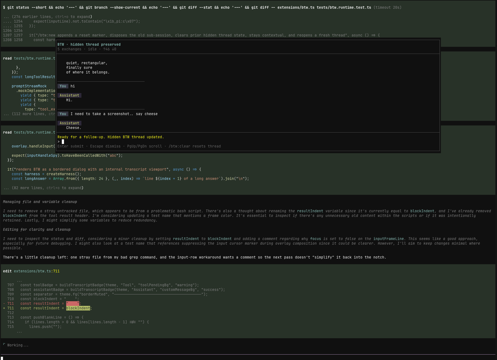

# pi-btw

A small [pi](https://github.com/earendil-works/pi-mono) extension that adds a `/btw` side conversation channel.

`/btw` opens a real pi sub-session with coding-tool access, and it runs immediately even while the main agent is still busy.



## What it does

- opens a parallel side conversation without interrupting the main run
- runs that side conversation as a real pi sub-session with `read` / `bash` / `edit` / `write` tool access
- keeps a continuous BTW thread by default
- supports `/btw:tangent` for a contextless side thread that does not inherit the current main-session conversation
- opens a focused BTW modal shell with its own composer and transcript
- keeps the BTW overlay open while you switch focus back to the main editor with `Alt+/`
- keeps BTW thread entries out of the main agent's future context
- supports BTW-only model and thinking overrides without changing the main thread settings
- lets you inject the full thread, or a summary of it, back into the main agent
- optionally saves an individual BTW exchange as a visible session note with `--save`

## Install

### From npm (after publish)

```bash
pi install npm:pi-btw
```

### From git

```bash
pi install git:github.com/dbachelder/pi-btw
```

Then reload pi:

```text
/reload
```

### From a local checkout

```bash
pi install /absolute/path/to/pi-btw
```

## Usage

```text
/btw what file defines this route?
/btw how would you refactor this parser?
/btw --save summarize the last error in one sentence
/btw:new let's start a fresh thread about auth
/btw:tangent brainstorm from first principles without using the current chat context
/btw:model openai gpt-5-mini openai-responses
/btw:thinking low
/btw:inject implement the plan we just discussed
/btw:summarize turn that side thread into a short handoff
/btw:clear
```

## Commands

### `/btw [--save] <question>`

- runs right away
- works while pi is busy
- creates or reuses a real BTW sub-session instead of a one-off completion call
- continues the current BTW thread
- opens or refreshes the focused BTW modal shell
- streams into the BTW modal transcript/status surface
- persists the BTW exchange as hidden thread state
- with `--save`, also saves that single exchange as a visible session note

## Overlay controls

- `Alt+/` toggles focus between BTW and the main editor without closing the overlay
- `Ctrl+Alt+W` is a fallback focus toggle for terminals that do not deliver `Alt+/` as a usable shortcut
- `Esc` still dismisses BTW immediately while the overlay is focused
- BTW now opens top-centered so the main session remains visible underneath it

### `/btw:new [question]`

- clears the current BTW thread
- starts a fresh thread that still inherits the current main-session context
- optionally asks the first question in the new thread immediately
- if no question is provided, opens a fresh BTW modal ready for the next prompt

### `/btw:tangent [--save] <question>`

- starts or continues a contextless tangent thread
- does not inherit the current main-session conversation
- if you switch from `/btw` to `/btw:tangent` (or back), the previous side thread is cleared so the modes do not mix
- opens or refreshes the same focused BTW modal shell
- with `--save`, also saves that single exchange as a visible session note

### `/btw:clear`

- dismisses the BTW modal/widget
- clears the current BTW thread

### `/btw:inject [instructions]`

- sends the full BTW thread back to the main agent as a user message
- if pi is busy, queues it as a follow-up
- clears the BTW thread after sending

### `/btw:summarize [instructions]`

- summarizes the BTW thread with the current effective BTW model
- always runs summarize with thinking off, even if BTW chat is using a thinking override
- injects the summary into the main agent
- if pi is busy, queues it as a follow-up
- clears the BTW thread after sending

### `/btw:model [<provider> <model> <api> | clear]`

- with no args, shows the current effective BTW model and whether it is inherited or overridden
- with values, sets a BTW-only model override
- `clear` removes the override and returns BTW to inheriting the main thread model
- if the configured BTW model has no credentials, BTW warns and falls back to the main thread model

### `/btw:thinking [<level> | clear]`

- with no args, shows the current effective BTW thinking level and whether it is inherited or overridden
- with a value, sets a BTW-only thinking override for normal BTW chat
- `clear` removes the override and returns BTW to inheriting the main thread thinking level
- changing `/btw:model` or `/btw:thinking` disposes the current BTW sub-session and applies the new settings on the next BTW prompt while preserving the hidden thread

## Behavior

### Real sub-session model

BTW is implemented as an actual pi sub-session with its own in-memory session state, transcript events, and tool surface.

- contextual `/btw` threads seed that sub-session from the current main-session branch while filtering out BTW-visible notes from the parent context
- `/btw:tangent` starts the same BTW UI in a contextless mode with no inherited main-session conversation
- BTW can inherit the main thread model/thinking settings or use BTW-only overrides via `/btw:model` and `/btw:thinking`
- `/btw:summarize` uses the current effective BTW model but keeps thinking off
- the overlay transcript/status line is driven from sub-session events, so tool activity, streaming deltas, failures, and recovery are all visible without scraping rendered output
- handoff commands (`/btw:inject` and `/btw:summarize`) read from the BTW sub-session thread rather than maintaining a separate manual transcript model

### In-modal slash behavior

Inside the BTW modal composer, slash handling is split at the BTW/session boundary:

- `/btw:new`, `/btw:tangent`, `/btw:clear`, `/btw:model`, `/btw:thinking`, `/btw:inject`, and `/btw:summarize` stay owned by BTW because they control BTW lifecycle, configuration, or handoff behavior
- any other slash-prefixed input is routed through the BTW sub-session's normal `prompt()` path
- this means ordinary pi slash commands like `/help` are handled by the sub-session instead of being rejected by a modal-only fallback
- if the sub-session cannot handle a slash command, BTW surfaces the real sub-session failure through the transcript/status state instead of inventing an "unsupported slash input" warning

This keeps BTW-owned lifecycle commands explicit while giving the side conversation the same slash-command surface as the underlying sub-session.

## Behavior

### Hidden BTW thread state

BTW exchanges are persisted in the session as hidden custom entries so they:

- survive reloads and restarts
- rehydrate the BTW modal shell for the current branch
- preserve whether the current side thread is a normal `/btw` thread or a contextless `/btw:tangent`
- preserve the current BTW-only model and thinking overrides for that session history
- stay out of the main agent's LLM context

### Visible saved notes

If you use `--save`, that one BTW exchange is also written as a visible custom message in the session transcript.

## Why

Sometimes you want to:

- ask a clarifying question while the main agent keeps working
- think through next steps without derailing the current turn
- explore an idea, then inject it back once it's ready

## Included skill

This package also ships a small `btw` skill so pi can better recognize when a side-conversation workflow is appropriate.

It helps with discoverability and guidance, but it is not required for the extension itself to work.

## Development

The extension entrypoint is:

- `extensions/btw.ts`

The included skill is:

- `skills/btw/SKILL.md`

To use it without installing:

```bash
pi -e /path/to/pi-btw
```

## License

MIT
